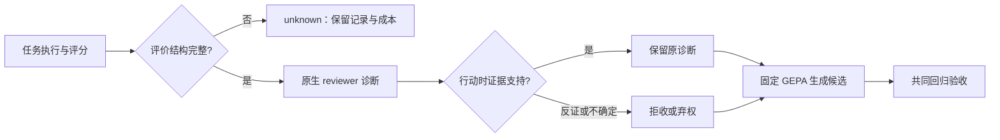

# 从任务评分到策略修改：τ2-bench 中的反馈证据准入

2026-09-17 · 研究工作稿。当前证据与未完成部分分别列明；本文件不是已发表论文，也不代表 GitHub 已发布。

**当前结果：来源核对具有案例层面的增量价值，语义准入仍有过度归责；尚无任务成功率提升证据。** G3已生成真实候选但未产生可采用更新；新登记的G4共享反馈对照在第4条父代运行后因关键用户模拟错误按协议停止，未进入候选比较。另行预登记的C1完成12个合成准入案例：5条充分支持建议保留、3条明确错误建议拒收，但4条证据不足建议仍有1条穿过组合准入。详见 [C1校准结果](C1_SYNTHETIC_RESULT.md)、[G4停止结果](G4_STOP_RESULT.md) 和 [G3记录](G3_PILOT_RESULT.md)。

## 摘要

交互基准能够评价任务是否完成，但任务得分、失败责任和策略建议是不同判断。若把它们直接串联，结构不完整的评分或缺乏行动时证据的诊断就可能进入优化。本研究以固定版本的 τ2-bench 文本零售任务为对象，保留原生 reviewer 与 GEPA，研究在二者之间增加选择性反馈准入的条件与代价。

现有证据包括 1,824 次公开历史运行、真实上游评价类的受控实验，以及新生成并独立核查的开发轨迹。受控实验复现了非空断言要求下，缺失或错配的评价仍可能获得满分分项的情况；所实现的完整性规则保留 120 项有效控制，将 440 项预定义异常置为 unknown。在 18 条完整开发轨迹的诊断审计中，准入模型对 8 条原生诊断给出 5 次拒收、2 次弃权和 1 次接受。独立来源核验发现，唯一被接受的诊断批评的是框架预置开场，该动作不由本次待优化的策略生成。结果表明，核对可见证据仍不足以保证责任归属，还须核验动作来源及干预范围。本研究未证明 Agent 成功率或优化效率提高。

后续G3已实际执行两次反思、生成并重新运行两个候选。原生反馈组的训练通过从1/2变为2/2，但候选验证中的额外退款时限承诺没有政策依据：官方验证仍为2/2，两名AI独立语义复核后的合格数为1/2。用户在父代与候选运行中的信息披露也不同，故训练变化不能唯一归因于策略修改。两臂最终均保留初始策略；本轮支持将训练得分、答复依据和候选采用分别验收。最终测试完成第一轮18次后，第二轮首个单元因网络重连事件被严格校验器拒收，按协议停止。18条完整测试有5条已核验合格、12条已核验失败、1条因用户有效性及关键违规争议保持未知；另有1条中断、17条未运行。三组最终策略相同，重复成功率不可估计，不能据此推断准入的净性能收益。

## 1. 研究问题与可证伪命题

一次失败至少有三种解释：Agent 的可见行为违反要求；用户模拟或工具交互使任务无法继续；结果不足以判断责任。即使责任可以定位，提出的修改也可能依赖当时不可见的信息。研究因此依次回答：

1. **评分能否解释？** 所需断言是否齐全、身份与类型是否正确、记录是否属于本次请求？
2. **诊断能否支持？** 行动前的政策、消息与工具定义是否支持错误判断、责任归属及修正建议？被批评的动作是否由本次可修改的组件生成？后一问题来自自然审计结束后的来源发现，属于探索性扩展。
3. **筛选是否值得？** 准入减少了多少无依据建议，又丢失了多少有效建议、增加了多少成本？
4. **策略是否受益？** 在固定优化器、任务划分和资源上限下，最终任务完成、重复完成与回归是否改善？

前一项通过不构成后一项的答案。原生诊断足够可靠、GEPA 自行消除错误反馈、或准入损失超过收益，均可否定机制的实际增益。

## 2. 方法与已有工作

固定 τ2 源码为 `2174a603f6d014ef94473ffa95957f6ce27100db`；固定 GEPA 为 `15ee314f9c7d34ec153b809d401f42f55c4dcd76`。任务范围为文本零售；本研究的 τ2—GEPA 接入不是官方预置对照。

τ2 原生 reviewer 已输出错误位置、Agent/用户来源和修正建议；GEPA 已执行反思与候选验收；CAST 等工作已有行动时可见信息约束。本研究不主张首次提出这些原则。拟检验的增量是：**能否对现成诊断实施可弃权的选择性准入，并量化其覆盖、成本和下游影响。** [原生 reviewer](https://github.com/sierra-research/tau2-bench/blob/2174a603f6d014ef94473ffa95957f6ce27100db/src/tau2/evaluator/review_llm_judge.py)、[GEPA](https://arxiv.org/abs/2507.19457)、[CAST](https://arxiv.org/abs/2608.30147)。

准入先核查评分完整性与记录绑定，再定位诊断对应动作。语义准入接收待核验的原生诊断，以及动作之前的消息、该动作、公开政策和工具定义；不直接传入完整隐藏任务或未来轨迹。原生诊断可能转述隐藏信息，这些转述属于待核验主张，不能充当行动时证据。诊断依据、Agent 责任与修正可观察性均获支持时，保留原诊断文字；有反证则拒收，不能确定则弃权。准入理由和被拒诊断不进入反思。共同的信息清理、GEPA 配置与候选验收用于减少两组其他差异。

这个机制允许放弃建议，因此必须同时报告有效建议损失。合法但可能次优的行为仍可能有改进空间；没有充分依据指责它，不等于相关建议毫无价值。

来源发现后的补充检索进一步收窄了创新主张。AgentGrad 已通过逐组件干预检验反馈应指向哪个 Agent，HarnessEvolve 已结合归责与候选门控。因此，本项目的贡献定位为具体可复核的失效案例、来源检查实现及其适用边界，不主张首次提出归责或干预选择原则。[补充相关工作及检索时点](../../supporting-evidence/tau-feedback-evidence/research/ACTION_ORIGIN_RELATED_WORK.md)、[全文方法比对](../../supporting-evidence/tau-feedback-evidence/research/FULLTEXT_NOVELTY_CHECK.md)。

图示为原 N1/G2 采用的逻辑；第 5.1 节的动作来源扩展未回填旧实验。拒收后的空反馈显式保留，不能自动回填原诊断；优化器仍可能依据其他共同输入作出推断。流程存在不代表各路径均在真实模型上执行或取得收益。

## 3. 已执行的实验

| 阶段 | 单位与范围 | 已观察结果 | 不能据此推导 |
|---|---|---|---|
| E0 历史审计 | 4 模型 × 114 任务 × 4 次，共 1,824 条 | 所保存相关检查未发现结构缺失；当前与历史奖励依据发生变化 | 当前评价器自然错误率、历史环境精确复现 |
| E1 受控评分 | 40 个含断言任务 × 14 类输入；另 74 个无断言控制 | 120 项有效结果保留；440 项指定异常为 unknown；74 项 not_applicable | 自然检出率、judge 语义准确率、整项任务错误通过率 |
| E2 信息投影 | 每条历史轨迹按固定规则选一个动作 | 1,824 条对未来及隐藏字段变化保持不变，对当前动作和政策变化有响应 | 完整历史模型输入重建、语义归责正确 |
| E3 数据库重放 | 原 1,824 条全保留 | 1,536 条进入官方严格状态重放，DB 分项均与历史相符；288 条预检异常暂缓 | 288 条历史评分错误或不可重放 |
| G1 订阅开发试跑 v2 | 预分配 12 题各两次 | 18 条已评价：13 合格、5 失败；1 条中断未评分、5 条未运行 | 完整 24 次成功率、优化效果或基准总体表现 |
| N1-R1 原生诊断审计 | 全部 18 条完整轨迹、8 条实际 Agent 诊断 | gate 拒收 5、弃权 2、接受 1；唯一接受项存在后续证实的来源误归责 | 准入总体准确率、有效建议召回率、策略提升 |
| E4 来源与干预范围 | 18 条完整轨迹；12 题 × 3 种策略的官方初始化 | 181 条 assistant 消息中 18 条框架预置、163 条绑定实际模型生成；36 次初始化的策略不同、开场不变，模型调用为 0 | 18 次误诊、整个任务不受策略影响、Agent 收益 |
| G2 真实 GEPA 开发案例 | 已知任务 85 训练、75 开发验证；两臂各独立执行 | 各运行 2 个 episode，训练均满分；官方 GEPA 均按原规则跳过，0 反思、0 候选，S0 不变 | 已完成策略改进、gate 因果收益、未见任务泛化 |
| G3 真实候选试点 | 2训练、2验证、6测试；优化已完成14个episode | 两次反思、两个候选；两臂均保留S0；测试18评价、1中断、17未运行 | 反馈筛选提升、把同策略重复波动称为干预效果 |

E1 的缺陷位于指定 NL 分项：缺失结果、空结果或错配等输入可能得到 1。JSON 损坏和顶层类型错误在上游引发异常，不能全部描述为错误通过。当前完整性契约也包含额外的强类型与跨请求绑定要求；这些并非都属于原评分函数的职责。[详细受控结果](../../supporting-evidence/tau-feedback-evidence/results/OFFLINE_FINDINGS.md)、[逐条结果](../../supporting-evidence/tau-feedback-evidence/results/contract_experiment.json)。

G1 使用现有订阅 CLI 的 `gpt-5.6-sol / low`，由结构化文本动作连接官方环境。模型抽样种子不可控，云端权重未固定；不声称与原生 API 传输完全等价。第 19 单元产生 WebSocket TLS 错误日志，按预定严格规则停止。即使该次调用后来返回完整输出，也未追认接受或补跑。全部 250 次调用计 3,493,693 输入、21,167 输出 tokens，未知用量为零；这是该版本的完整成本，不含此前预检。独立停止核查（本地审计材料，未纳入公开包）。

## 4. 已有轨迹提供的研究线索

任务 76 的一次运行已经算出历史消费总额，却只把数字写进内部转接摘要，没有回答用户。这是可由可见证据定位的沟通遗漏。另一次运行完成了该要求；这说明表现有差异，不能单凭两次结果认定某个策略修复有效。

任务 59 的失败包含“较早订单”未充分绑定及澄清后用户结束。官方判定任务未完成有依据，但归责需要额外判断。任务 73 的工具参数列表顺序不同于参考动作，商品集合与最终状态一致，且其奖励不以 ACTION 分项为依据，不能把该差异当作需要修复的错误。轨迹语义复核（本地审计材料，未纳入公开包）。

这些轨迹案例本身只支持问题拆分。N1-R1 随后直接检查实际原生诊断，补充了以下证据。

## 5. 自然诊断审计与当前边界

N1-R1 已对中断时全部 18 条完整轨迹完成描述性审计，原来的 1 条中断和 5 条未运行仍保留于总体处置表。18 条来自 12 个任务，其中 6 题有两次、6 题仅一次；完成者由预定顺序和停止时点决定，不是随机抽样。

执行顺序为全体 reviewer → 固定诊断选择 → 匿名行动视图 → 封存两名研究代理的独立标签及裁决 → gate。实际共生成 8 条诊断，全部标为 Agent 来源；8 条全部进入审查，没有诊断因抽样上限被排除。两名标注者的 24 个维度判断有 20 个一致；裁决后的合并标签为 6 条证据不足、2 条不支持、0 条充分支持。标签不是人工金标准，既有轨迹熟悉度与同模型家族偏差均已披露。全部结果和标签先后顺序已经独立复核。

gate 对两条不支持标签均给出拒收，对六条不足标签给出三次拒收、两次弃权及一次接受。由于没有三维均受支持的自然卡片，本研究不能估计有效诊断保留率。部分查单建议可执行，但批评 Agent 必须查单的依据不足；严格拒收整条诊断可能同时损失其中有用的子建议。这里观察到的是质量与覆盖之间的张力，尚未量化下游损益。

新增的 18 次 review 与 8 次 gate 共消耗 414,889 输入、11,209 输出 tokens，未知用量为零。原始轨迹生成成本、既往探针及研究代理标注成本另列。原 G1 的自然收益比较已关闭；N1-R1 不恢复其继续条件，也不测量策略收益。[逐卡描述性结果](N1_R1_FINDINGS.md)、独立复核（本地审计材料，未纳入公开包）。

### 5.1 揭盲后的来源发现

唯一接受项来自 task81/29 的第 0 条 assistant 消息。reviewer 批评它只问候而未先认证，gate 认定该动作受 Agent 控制。但固定版官方 orchestrator 在非 solo、无初始历史时直接插入开场常量；真实调用账本先运行用户模拟器，之后才调用 Agent。第一次真正的 Agent 生成已经要求账户认证。本项目策略干预只修改 system prompt，无法改写此前由框架插入的开场。

因此，**消息角色、文本可见性与策略控制权是不同属性**。这条结果由固定源码、任务初始状态、实际调用顺序和消息元数据共同支持，不能只凭文本相同作判断。它在 gate 结束后发现；原先的“不足”标签及 gate 接受结果均保留，不追改为预先已知的答案。

对应改进是增加动作来源检查：有唯一生成调用且内容逐项对应的模型动作具备进入本次策略优化的来源资格；有明确框架来源且不在本次策略干预范围内的动作转交框架审查；证据缺失则保持 unknown。这不是语义正确性的替代，也不抵抗可以重写整套账本的恶意生产者。新增实现及受控验证与原 N1 版本分开保存。G3 的实际顺序为先做并计费语义审查，再与来源资格取交集；没有前置跳过语义调用，不能据此宣称节省这部分费用。

### 5.2 E4：对控制范围的受控确认

E4 在 N1 揭盲后独立固定计划，核对全部 18 条完整轨迹，并对原 12 个开发任务运行三种策略：原始提示、G2 的共同初始策略、明确要求先认证后问候的策略。官方初始化器实际接收了不同 system prompt；36 次初始化均产生相同的固定开场，生成入口以及 run/step 均被阻断，实际模型调用为零。该控制只证明此配置下的开场不受所试策略修改影响，不证明后续行为不可改变。

对原始轨迹的 181 条 assistant 消息，18 条具备固定框架初始化来源，163 条与唯一模型生成调用及输出逐项对应，未出现未分类项。这个比例是消息来源构成，不是 reviewer 误诊频率；本批已证实的相关误归责仍为 N1 的那一条。新增来源路由可以把这一目标转交框架审查，但它没有作为修复版插入旧 N1 或 G2 来冒充前瞻效果。

公开复现入口 `scripts/reproduce_origin_initialization.py` 无需模型账号，只重跑初始化控制；它不依赖未公开的自然调用账本，也不重建 N1 的历史结果。[E4 核验说明](E4_ACTION_ORIGIN_REVIEW.md)。

## 6. G2：真实优化器的合法跳过终点

G2 单独固定了已知开发题 85（训练）和 75（开发验证），在相同模型、优化器与资源上限下依次执行 B1、B2。每臂重新生成自己的初始策略轨迹，不复用 G1 或另一臂。任务是在知晓 G1 后目的性选择的，不能称未见任务；相同模拟 seed 也不能消除模型抽样差异。

两臂的 S0 训练结果均为满分，因此固定版 GEPA 按 `skip_perfect_score=True` 跳过反思。各臂实际运行 2 个 episode，共 4 个；反思、候选生成与候选验收均未发生，最佳策略保持 S0。B1 消耗 26 次 CLI、362,053 输入和 2,081 输出 tokens；B2 消耗 25 次、344,846 输入和 2,038 输出。两臂总计 51 次、706,899 输入、4,119 输出，未知用量为零。

这验证了真实环境接入和优化器合法停止路径，**没有实际覆盖反思生成新策略的路线，更没有证明优化收益**。不能为了制造候选，事后关闭满分跳过、改选失败题或补造诊断。两臂的调用次数差异来自各自实际路径，不能归因为准入节省了成本。[冻结开发案例协议](../../supporting-evidence/tau-feedback-evidence/research/G2_EXPLORATORY_CASE_PROTOCOL.md)、[实际结果复核](G2_EXPLORATORY_RESULT_REVIEW.md)。

### 6.1 G3：候选生成后的验证与保留旧策略

G3是单独登记的新试点，未改写G2终点。登记时统一关闭满分跳过，仍要求训练严格改善，每臂只给一次候选机会及相同资源上限。两臂各自生成父代和候选轨迹，不能把不同的用户展开路径当作已经配对控制的反事实。

B1原生反馈组产生一条诊断并进入真实反思；诊断把用户尚未披露的备选目标写成已经明确提出的要求，暴露了结果判断与行动时归责的差别。候选训练从1/2通过变为2/2，验证官方得分与初始策略同为2/2，GEPA在持平时保留S0。候选还将取消退款的5–7工作日期限扩展到退货申请，两份独立语义审查均认为缺乏政策依据，验证合格数因此为1/2。共同验收也记录该回归，但不能说它单独阻止了GEPA原本会采用的候选。

B2准入组没有产生原生训练诊断，语义准入调用为零；候选由共同公开政策反思生成，父代与候选训练均为2/2，按严格改善规则拒绝，未进入候选验证。本轮没有激活反馈筛选差异，因此无法估计它对任务表现的收益。两组优化共240次CLI调用，3,589,164输入、27,027输出token，未知用量为零；调用费用差还包含额外验证与对话路径差异。

冻结选择时发现原封存器混用了GEPA选中的S0身份与已运行候选的验证行。保留原文件后另建v2，仅修正证据绑定，保持原选中与否、阈值、数据不变；两份优化复核及最终策略均在测试前封存。这是登记后实现修正，不能声称所有选择代码都提前冻结。三组最终策略完全相同，最终测试差异只能描述为同策略运行变化。[G3完整阶段记录与费用](G3_PILOT_RESULT.md)、[绑定修正](../../supporting-evidence/tau-feedback-evidence/research/G3_SELECTION_BINDING_AMENDMENT.md)。

### 6.2 最终测试的停止结果

三组各分配12次，各完成第一轮6题。B0/B1/B2官方通过分别为3、3、2；已核验合格分别为2、2、1，已核验失败各4，B2另有1条unknown。B1第二轮首条中断，未运行数分别为6、5、6。task62三条虽官方满分，但都提供了用户或工具未给出的零售范围外诗歌知识；该案例显示任务断言未覆盖所有答复义务。unit016的关键违规存在两审分歧、用户有效性均未知，按既定规则保留未知。两审共覆盖18条、各90个来源hash；过程并非完全盲审。

第273次CLI调用发生网络流错误，随后CLI内部重连并返回JSON及用量，但原事件规则拒收，输出没有交给环境执行。没有运行器补跑或事后接纳，也没有证据将错误归为额度耗尽。测试费用包含该调用，共273次CLI、3,689,217输入和21,717输出token；G3优化加测试共513次、7,278,381输入和48,744输出token。CLI账本未知用量为0，底层提供方请求数和重连增量费用不可独立观察。

预定两次重复未完成，pass²、完整配对差、修复率/回归率及全计划单位合格成本不可估计。固定分配分母上的已知成功比例不代表完整成功率，未知/中断/未运行不改成失败。三组策略相同，数值差异也不构成机制效果。[终点及费用表](G3_PILOT_RESULT.md)、[停止审计](../../supporting-evidence/tau-feedback-evidence/research/G3_TEST_STOP_REVIEW.md)、[公开衍生摘要](../../supporting-evidence/tau-feedback-evidence/results/G3_PUBLIC_SUMMARY.json)、[对话与逐条审查](../../supporting-evidence/tau-feedback-evidence/results/G3_PUBLIC_TRAJECTORIES.json)。

### 6.3 G4：共享反馈对照的停止终点

为解决G3两臂父代反馈不同、B2诊断为空的问题，G4在新调用前冻结4个开发家族、4个验证家族和6个在线优化留出家族。四批父代及共同S0验证先封存，两臂随后引用完全相同的父代证据；所有真实候选均执行共同验证，包括被GEPA拒绝的候选。四个配对机会和处理激活规则事先固定，目标是区分“输入未发生变化”和“变化未产生收益”。公开任务均曾静态处理，不能称秘密测试集。

实际完成第一批4个环境episode及其原生review。第4条被原生review标记关键用户错误，按冻结规则停止；3条完整父代记录、1条父代流水线停止。计划120个优化阶段episode中，4个完成环境评价、116个未运行；8个提案均未开始。最终策略尚未选择，测试清单未展开，不能将上限36条写成已经分配或失败的36条测试。研究保留停止前缀，未改题、改seed或启动同题版本追求正结果。

停止前两条进入gate的自然诊断均被拒收。其理由分别涉及把尚未披露的地址修改退路视为用户已明确要求，以及用隐藏参考答案指定“更早的订单”。这些原始文本可以支持信息边界的案例讨论；gate拒收自身不能充当判断正确的独立证据，也未形成一次完成的GEPA处理比较。

G4累计61次CLI调用，893,326输入和9,586输出token，未知用量为0。全部原始流重放通过，未观察到重连通知；停止来自语义有效性规则，不能归因于网络或预算耗尽。H1候选收益与H2留出收益均未识别；停止不是机制无效的证明，也不是有效的证明。[冻结协议](../../supporting-evidence/tau-feedback-evidence/research/G4_PROTOCOL.md)、[分组审查](../../supporting-evidence/tau-feedback-evidence/research/G4_SPLIT_REVIEW.md)、[终点与独立复核](G4_STOP_RESULT.md)。

### 6.4 C1：正例保留与错误准入的合成校准

N1自然样本没有充分支持正例，无法估计自然正例保留率。C1因此作为独立组件校准，事前封存12张合成卡、匿名首轮复核与5充分/3不支持/4不足的参照分层，不把合成例插入自然诊断池。实际12次语义调用全部完成：充分支持5/5接受、不支持3/3拒收；不足层2接受、1拒收、1弃权。来源核对进一步排除一条属于固定框架开场的接受项，但另一条模型来源的不足项仍被接纳。

据预先参照，语义三态一致为9/12，组合准入共接纳6条（5充分、1不足）。这个结果说明来源资格与语义依据需要分别验收，并不表示整体准入已校准可靠。模型来源不能证明归责正确；拒收证据不足项也不等于准确识别“证据不足”。固定卡片上的5/5保留不能外推自然召回，AI作者与AI独立标注者的一致意见不能代替人类金标准。

C1共182,910输入和4,128输出token，原生reviewer、环境运行及GEPA调用均为0。其语义校准结果、合成来源路由及成本单独报告，不与G4的天然发生率或策略效果混算。[完整结果与逐卡记录](C1_SYNTHETIC_RESULT.md)。

## 7. 可复现性与交付范围

实际M1–M6接口、信息权限、状态流转、方法论对应及一条完整真实候选案例汇总在[系统规格](../../supporting-evidence/tau-feedback-evidence/research/SYSTEM_SPECIFICATION.md)。它是登记后的实现说明，预先约定的配置仍以原协议与manifest为准。

上游文件、依赖、协议、输入与执行记录均保留版本及哈希。旧实验按各自源码快照解释；当前代码的修复不追写旧结果。哈希用于发现内容变化，不认证能够改写整套记录的恶意生产者。

G3两份AI审查分别落盘，但研究助手在保存前6条测试判断后，一次宽范围检索意外接触了部分旧优化标签和早期测试摘要。旧判断没有追改；检索可见范围、截断及纠正措施另作记录。该过程不具备完整盲法保证，不能用两份意见一致替代外部人类验证。[复核过程偏离披露](../../supporting-evidence/tau-feedback-evidence/research/G3_REVIEW_PROCESS_NOTE.md)。

公开交付需要经过资产审查，不能直接上传含 CLI 原始事件、完整配置、个人路径或系统权限记录的工作目录。若公开包省略某些本机运行材料，将明确区分离线可复现部分、可审计的派生结果与订阅环境限制。当前新结果仍在本地。[执行状态](PROJECT_STATUS.md)、复现入口（本地审计材料，未纳入公开包）、GitHub 交付目标（本地审计材料，未纳入公开包）。

## 当前结论

现有实验支持把“评分完整”“归责有据”“动作可由当前干预修改”和“策略有益”分别验收。研究复现了指定评分结构失效，发现真实诊断的框架来源误归责，并观察到官方满分候选中的无依据承诺。C1进一步显示来源核对可额外拦截一条语义审查接纳的框架归责，但组合机制仍放行一条证据不足反馈。可辩护的贡献是具体的证据准入实现、控制范围反例、正反例校准及可复核的候选验收流程；不是已证明有效的优化算法。G4按协议止于父代阶段，主对照未完成。当前没有获得可采用的策略更新，没有证明Agent性能提升，净收益和泛化问题保持开放。
