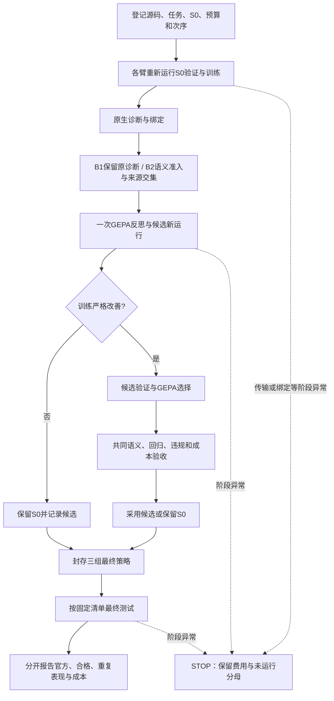

# 反馈证据闭环：当前实现与研究规格

2026-09-17。本文在G3优化完成、最终测试执行期间整理，并在按协议停止后更新，描述当前源码和已封存行为，不是新增预登记，也不修改原实验。真实结果以[G3结果](../../../core/03-tau-feedback-evidence/G3_PILOT_RESULT.md)为准。

## 1. 研究对象与可检验范围

保留固定版本τ2-bench的文本零售环境。它提供政策、工具、可复位的数据库、动态用户模拟、可修改Agent提示及官方评价；因此能重新执行候选，而不必拼接旧轨迹。当前不更换官方任务评分，不把合法替代工具路径当成错误。

新增部分位于原生reviewer与GEPA之间：核验反馈绑定及行动时证据，并用执行来源限制可用于系统提示优化的诊断。共同验收另查验证质量、关键违规、回归和费用。来源资格只说明本次干预触及哪个组件，不证明该提示修改能修复失败。

本研究可检验指定结构异常、来源边界、候选生成与验证流程。公共合成题、AI用户及AI复核不能证明生产表现；本轮单次优化、六题仅完成一轮重复，不能证明稳定平均收益。没有执行在线行动检查、自适应采样、跨领域或Coding Agent实验；这些在用户简报中属于后续扩展。

## 2. 已有能力与本项目增量

| 环节 | 复用的能力 | 本项目实际增加的内容 | 证据边界 |
|---|---|---|---|
| 交互与结果 | τ2环境、用户模拟器、工具、数据库和NL评价 | CLI结构化动作接入、完整费用账本、请求及轨迹绑定 | 不等价于原生API传输；模型采样和云权重不可控 |
| 失败诊断 | 原生reviewer逐轮检查、错误来源和纠正建议 | 非空/有效审查契约、固定诊断抽样、行动前投影和准入 | 原生reviewer本来就会归责，不以此宣称创新 |
| 来源与干预 | 固定框架及真实生成记录 | 区分模型生成、框架预置、非Agent和未知；限定system prompt可改范围 | 基于可信宿主记录，不认证恶意伪造的整套账本 |
| 策略搜索 | 固定GEPA的反思、候选评价和选择 | 两臂共同输入清理、资源限制、独立共同验收与封存 | 未重实现通用优化算法；一轮候选不是完整搜索性能评估 |
| 结果复核 | 官方分数和重复运行概念 | 分别保留结构、语义、用户有效性、关键违规和未知，固定分母报告 | AI意见一致不等于人类金标，过程偏离另行披露 |

与AgentGrad、HarnessEvolve的相近性及限制见[全文比对](FULLTEXT_NOVELTY_CHECK.md)。增量定位为具体来源准入适配和可复核失效案例，不主张首次提出归责、门控或反思优化。

## 3. 模块的输入、输出与决策

| 模块 | 实际接口与输入 | 输出与触发决策 |
|---|---|---|
| M1 任务与观测 | `run_subscription_episode(client, task, output, simulation_seed, strategy, limits)`；官方Task与固定配置 | `request/simulation/trajectory/calls/outcome`；先预留运行单元再执行，已尝试中断不变成未运行 |
| M2 四层评价 | `structural_outcome`、官方reward、两份逐例语义/用户/关键违规标签、调用账本 | 保留官方分数；另算合格结果及成本，无法确定时不自动判合格 |
| M3 反馈校准 | `review_simulation`产生原生诊断；`audit_native_diagnosis`使用动作前消息、动作、政策和工具定义 | 支持/反证/不足分别接纳、拒收、弃权；审查失败不冒充空诊断 |
| M4 归责与范围 | `classify_action_origin(message, calls, OriginContext)`及`strategy_feedback_eligibility` | 模型动作有资格继续；框架/非Agent标记应转交对应审核；未知弃权，不自行修框架 |
| M5 候选与经验 | `G3Adapter`、`run_g3_arm`及GEPA；绑定的原诊断、共同政策和S0 | 仅改`reusable_strategy`，保存实际反思、候选、父子新运行及拒绝理由；未通过者不称已验证经验 |
| M6 验收与停止 | `decide_strategy(seed, candidate, gepa_selected_new, baseline_rows, candidate_rows, validation_ids)` | 全部条件满足才采用，否则保留S0；数据身份矛盾报错，阶段异常写STOP，不自动补跑 |
| 终报与交付 | `aggregate_test`、`report_g3_test`及两个公开结果导出器 | 核对固定36单元、策略/来源hash、双份标签和费用；终点之后生成报告和公开衍生证据 |

对应源码：[运行](../src/tau_feedback/subscription_episode.py)、[反馈](../src/tau_feedback/subscription_feedback.py)、[来源](../src/tau_feedback/action_origin.py)、[G3适配器](../src/tau_feedback/g3_optimization.py)、[验收](../src/tau_feedback/g3_acceptance.py)、[指标](../src/tau_feedback/g3_reporting.py)。

框架没有额外实现一个通用的自动“任务进度真值机”。过程证据来自实际消息、工具输入/结果和最终状态，语义审查按明确政策复核。候选提示中的请求清单要求是模型策略，不能把模型自述当成已核验进度。

用户提供的美团方法论作为设计输入，未将它包装为另行核实的外部论文。落实关系如下：

| 设计原则 | 当前落点 | 影响的决策 |
|---|---|---|
| 观测＋评测驱动迭代 | M1原始轨迹与M2评价、M3诊断 | 有证据才形成修改依据，分数不直接充当归因 |
| 被测对象是系统 | 固定模型档位、政策、工具、模拟器及环境，只改一个策略字段 | 区分策略变化与框架/用户路径变化 |
| 结果、过程、效率、风险 | 官方结果、政策语义、调用/token/时间、关键违规 | 共同验收并报告未知，成本不覆盖质量失败 |
| 业务与能力对应 | 多目标遗漏对应请求跟踪；内部摘要未答客户对应交付沟通；无依据承诺对应证据使用 | 用具体案例定位待改能力，不宣称已有通用能力分类器 |
| 客观检查配合语义 | 结构/hash/数据库规则与引用证据的AI检查 | 可程序核对的先核对，语义意见不能覆盖记录冲突 |
| 校准评价者 | N1逐维分歧、边界案例及G3分别记录的两份标签 | 保留不足与分歧，意见一致不能独自验证真值 |
| Good/Bad Case资产 | 原始轨迹、候选策略、验证结果和版本/拒绝原因 | 候选经验与通过验收的经验分开，本轮未增加已验证策略 |
| 迭代评价体系 | 独立版本、修正说明及E4/G3新增来源规则 | 不改写旧标签或当前冻结门槛，不存在自动学习Rubric的实现 |

来源路由目前输出明确标签和记录，没有自动运行一个额外的框架修复审核队列。

## 4. 信息隔离与最小数据契约

`EpisodeBinding`绑定任务键、任务内容、策略、episode、完整轨迹与诊断池hash；`BoundAdmission`再绑定诊断序号及准入记录。`HostEvidence`保留本机可追溯原始证据，优化器接收引用及经过共同投影的反馈。身份不一致或原始文件改变时拒绝继续，不猜测应匹配哪个样本。

| 接收方 | 可以读取 | 不应读取 |
|---|---|---|
| 执行Agent | 公开政策、可用工具、当时对话及工具结果、当前策略 | 私有用户目标、参考动作与最终测试评价结果 |
| 原生离线reviewer | 官方允许的完整任务、用户信息、轨迹和参考材料 | 其输出仍是待核对诊断，不能自动变成Agent当时已知事实 |
| 行动时语义准入 | 待核验原生诊断、当前动作、之前的可见消息、政策和工具定义 | 不直接传入完整隐藏任务/未来轨迹；诊断可能转述其内容，但不得将转述当作行动时证据 |
| 来源检查 | 已绑定生成记录、渲染动作、固定初始化上下文 | 不以role名称、相同文本或缺少日志单独证明来源 |
| GEPA反思 | 共同公开政策、保留的原诊断及共同清理后的载体 | gate拒收理由、完整宿主轨迹、已知实例字面量和测试反馈 |

G3实际顺序是先调用并计费语义准入，再与来源资格取交集。来源检查没有提前跳过语义模型调用，不能宣称节约这部分成本。共同字面量检查也不保证排除了所有语义层面的题目记忆。

## 5. 状态流转及冻结对象

冻结对象包括τ2/GEPA源码、任务与划分、政策/工具、模型名称与推理档位、模拟seed、诊断上限、搜索/选择规则和资源上限。模型版本别名不等于云端权重被固定；模拟seed不等于模型采样seed。

共同验收要求GEPA选中新候选、验证全覆盖、合格数严格提高、原合格任务不回归、无新关键违规且判断完整、验证输入加输出token比不超过1.25。身份矛盾与普通质量不足分开处理。保留S0是未采用候选，不存在已部署新策略再热回滚的生产行为。

当前每臂一次候选机会；6000字符约束限制的是一个可变策略模块，并不保证字符编辑距离最小。费用上限是客户端检查，单次请求可能越过累计token阈值；没有将它描述为服务器硬限额。旧选择封存器的身份绑定修正及登记后报告实现见[修正说明](G3_SELECTION_BINDING_AMENDMENT.md)。

## 6. 一条真实闭环，而非示意成功案例

G3 B1训练task76的父代因为删除单件商品不受支持而转接；用户当时没有完整披露私有场景中的备选要求。原生诊断却将这些目标描述为已明确提出。反思实际生成了九条通用策略，包括持续跟踪多项请求、检查用户已经说明的备选方案、只在确实无法处理时转接；新文本为2214字符，实际重新运行。

父代训练通过1/2，候选2/2；但候选运行中用户开场披露的目标更多，不能只把成功变化归给策略。候选在另一验证task16上完成数据库目标，却将取消退款的时限扩大到退货退款。官方验证仍为2/2，两份语义复核的合格数为1/2；GEPA的验证最佳仍为S0，共同验收也不通过。故经验资产保留“诊断—候选—运行—拒绝”的全链路，没有把这九条策略登记为已验证改进。

此外，B1的S0验证已达2/2，严格合格数提升在这个二题验证集上没有空间；B2的父代训练2/2，也无法在相同二元训练批次严格改善。这是本次搜索路径的识别限制。即使没有额外退款承诺，B1也不满足共同验收的严格改善条件。不能把未采用全部归因于某一道新增门控，也不能据此断言反馈机制普遍无效。

阶段、逐例依据、候选hash、费用及最终选择见[G3结果](../../../core/03-tau-feedback-evidence/G3_PILOT_RESULT.md)。公开对话衍生视图已保留完整已评价轨迹及两份判断，省略宿主/登录/原始传输数据；哈希不能替代被省略的真实性证据。

## 7. 假设与当前能够回答的问题

| 问题 | 已有检验 | 当前解释 |
|---|---|---|
| 指定不完整评分能否被识别 | E1真实评价类受控输入，120有效保留、440指定异常为unknown | 对指定输入成立；没有自然发生率估计 |
| 可见文本是否足以保证诊断归属 | N1实际接受了框架开场诊断；E4源码、调用与36次初始化控制 | 存在明确反例，来源/可修改范围需另查 |
| H1：筛选反馈是否产生更好的候选 | N1描述反馈去向；G3各有实际候选，但B2没有原生诊断、gate未激活 | 不能识别筛选的候选质量增量，也不构成普遍无效的证据 |
| H2：改进是否迁移并减少复发 | 最终策略已经封存且三组相同，36次计划已停止，18次完成评价、1次中断、17次未运行 | 测试可描述重复表现；没有策略差异就不能识别迁移收益；未预先建立充分的类型机会分母，不估复发下降率 |
| H3在线检查、H4自适应采样 | 本轮未加入，避免同时改变多个机制 | 保留为独立扩展，不写成已验证结果 |

两位AI代理的复核并非人类金标；共同偏差、既往熟悉度及一次误见旧标签事件见[过程披露](G3_REVIEW_PROCESS_NOTE.md)。对有效建议的自然召回率、每次有益更新成本等，若没有支持项或有益更新，保留不可估状态，不以零填充未知分母。

## 8. 工程交付与后续优先级

现有工程证据覆盖严格输入检查、完整运行记录、绑定、预算、异常停止、策略封存及离线组件验证。没有生产服务部署、长期负载测试、正式安全隔离认证或外部真人标注，不能把研究原型直接称为已经生产验证的系统。

本轮已按协议停止，终报及公开衍生结果/对话已生成；测试18次完成评价、1次中断、17次未运行。新包按该终点进行隔离复现，不恢复原研究。若继续新实验，优先解决反馈未激活、起点满分及用户披露差异造成的可识别性问题，再考虑同池来源消融和等量反馈控制；须另行登记，保留本轮负结果。在线检查、自适应采样和跨域不应挤入本轮固定对照。

三句话总结：我们复用τ2交互环境、原生reviewer和GEPA，研究现成诊断进入策略优化的条件。具体问题是评分、归责、干预范围和候选可靠性并不等价。实验据实报告结构及来源反例、真实候选的采用/拒绝、固定测试表现与费用，并明确尚不能识别的机制收益。
